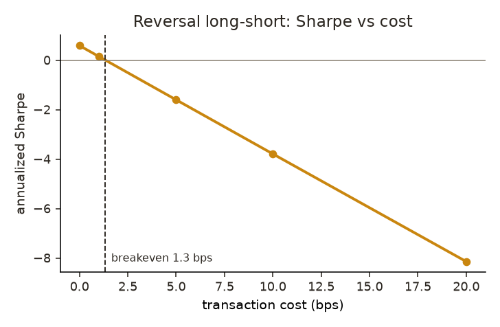
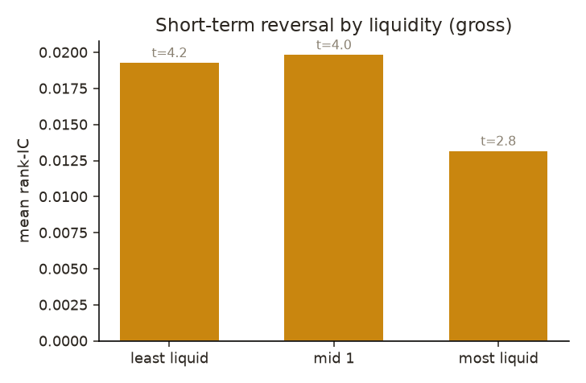

# market-gnn

**A graph neural network for cross-sectional equity signals — and a leak-controlled
test of whether the graph actually helps.**

Stocks co-move in groups (sector, supply chain, shared factors). This project models
that structure as a graph, runs a GNN over it, and asks one clean, falsifiable
question:

> Does graph structure add **incremental out-of-sample rank-IC** over an **identical
> feature set fed to a matched non-graph model**, after point-in-time construction and
> purged walk-forward evaluation?

## Findings (real data: 90 large-caps, 2014–2024, weekly)

Tested every configuration by which a graph could plausibly add cross-sectional **return**
signal, and decomposed where the apparent "graph alpha" actually comes from:

1. **Contemporaneous graph is a red herring.** Frozen ≈ dynamic ≈ *no graph* for a linear
   model; the GNN ties the matched MLP (and is slightly worse — over-smoothing). Same-date
   message passing can't carry return signal, and doesn't.
2. **Lead-lag / spillover is a *powered* null on large-caps** — even over a *real* economic
   link. Neighbours' past returns → own future return (the channel Cohen–Frazzini /
   industry-momentum predicts). We first **plant** the effect and show the pipeline
   **recovers it** (IC 0.089, HAC t 9.6, rewire-null clean) — proving power — then on real
   data find ~0.006 with **80% power to detect 0.036**. And it is not a proxy artefact: a
   graph of genuine **13F institutional co-holding** (Anton–Polk "Connected Stocks", built
   from the actual SEC filings, PIT) is *also* a powered null (IC +0.010, 80% power to detect
   0.023, rewire-clean) — the warmest linkage tested, still not significant. Absent, not
   undetectable; consistent with the effect living in small/illiquid names this universe
   excludes.
3. **The vol "predictability" is ~90% persistence** — a naive trailing-vol forecast gets 0.435
   of the model's 0.479, and the model is *worse* on QLIKE (level calibration).
4. **Survivorship inflates it:** point-in-time membership correction shrinks the already-null
   return IC.
5. **What DOES carry signal (positive control):** the same harness finds **short-term (1-day)
   reversal strongly significant on real data** — IC +0.015, HAC t 3.4, p<0.001, FDR-sig. So
   the graph nulls are *real absences*, bracketed by positive controls on both real data
   (reversal) and synthetic data (planted lead-lag) — not a pipeline that can't find anything.
   (Gross rank-IC; reversal is high-turnover and cost-fragile — reported as a statistical
   control, not a tradable strategy.)

**Net:** the graph adds no return signal that survives leak-free, powered, control-checked
evaluation; the return signal that *is* present (short-horizon reversal) is non-graph and
cost-fragile — and this repo is the harness that separates a real effect from the survivorship /
overlap / over-smoothing artifacts that make graph "alpha" look real.
Full decomposition and numbers in [RESULTS.md](RESULTS.md).

The reversal effect is real gross but dies at ~1 bp of cost, and (on a 194-name universe) is
significant across liquidity terciles without a significant illiquidity gradient:

<p align="center">
  
  &nbsp;
  
</p>

## Why trust the null? The harness has teeth.

A null is only worth reporting if the pipeline could have found signal. Two guarantees:
- **It detects signal when present** — the planted lead-lag recovery above, and a
  **future-injection canary** (feed a feature = tomorrow's return → IC spikes to ~1.0).
- **It rejects spurious signal** — **label-shuffle** collapses IC to ~0; the **degree-preserving
  rewire** null stays flat; **purged walk-forward** removes label-overlap leakage; point-in-time
  purity of graph/features/labels is asserted, not assumed.

```bash
pytest -q     # 58 tests (2 GNN A/B tests skip without torch); core needs no GNN stack
```

## Quickstart

```bash
pip install -e ".[dev]"          # core + tests (no torch needed)
pytest -q                        # 58 tests (56 without torch), ~30s
python -m marketgnn.train --synthetic          # offline factor-market demo
```

Example output (synthetic market — shape of the real ablation):

```
      graph model target mean_ic   hac_t naive_t   ci_lo  ci_hi  n_dates  fdr_sig
correlation ridge    ret  -0.007  -0.321  -0.269  -0.053 +0.036       52    False
correlation ridge    vol  +0.172  +9.828  +9.529  +0.139 +0.207       52     True
       none ridge    vol  +0.177 +10.573  +9.907  +0.147 +0.213       52     True
```
Returns → honest null; volatility → real, FDR-significant signal. Note `hac_t < naive_t`
on every row: the Newey–West correction deflating the autocorrelation-inflated t-stat.

To train the GNN vs the matched MLP (the primary H1 test): `pip install -e ".[gnn]"` then
`python -m marketgnn.train --synthetic --models mlp,gnn`.

## How it works

- **Graph** (`graph.py`) — per date, a point-in-time graph: trailing-correlation kNN
  and/or sector edges. Fair null for "does topology matter" is a **degree-sequence-
  preserving rewire** (`rewire`), not just an average-degree random graph.
- **Features** (`features.py`) — momentum / reversal / vol / turnover / beta (vs **SPY**,
  never a survivor mean) / size, plus a **neighbour-return** feature that both the GNN and
  the MLP consume — so the GNN must beat an MLP that already has the graph-derived feature.
  Normalized **cross-sectionally per date**.
- **Models** (`models/`) — ridge and LightGBM baselines; the GNN and MLP are the **same
  network** toggling whether real edges are visible (zero the graph → recover the MLP),
  sharing head, a differentiable **ranking loss**, and training loop, so the A/B is clean.
- **Evaluation** (`evaluate.py`) — per-date rank-IC aggregated with **Newey–West/HAC**
  t-stats and a **block bootstrap** (labels are autocorrelated; i.i.d. inference overstates
  significance). One pre-registered primary endpoint (H1); the grid is **BH-FDR** controlled.
- **Splits** (`splits.py`) — **purged, embargoed walk-forward**: training labels whose
  horizon overlaps the test window are removed.
- **Power** (`power.py`) — minimum detectable IC gap given cadence and autocorrelation, so
  a null is distinguishable from "underpowered."
- **Lead-lag** (`leadlag.py`) — the strictly-lagged neighbour-momentum signal (neighbours'
  past → own future), a **planted-signal recovery** proving the pipeline detects spillover,
  and the own-momentum control. This is the experiment that makes the null a *result*.
- **Robustness** (`robustness.py`) — vol model vs the naive random-walk forecast (rank-IC and
  QLIKE), showing how much of the vol IC is mere persistence.
- **Signals** (`signals.py`) — real-data positive controls: textbook anomalies (short-term
  reversal, 12-1 momentum) run through the same harness, so a graph null is provably a real
  absence rather than a pipeline that finds nothing.
- **Costs** (`costs.py`) — the decile long-short a signal implies, net of transaction costs:
  breakeven bps and net Sharpe. Turns "cost-fragile" into a number (reversal breaks even at
  ~0.9 bp → arbitraged net). A gross IC without this is how backtests lie.
- **Conditioning** (`conditioning.py`) — liquidity-tercile analysis: is reversal an
  illiquidity effect? A HAC test on the low-minus-high IC spread, over a widened ~180-name
  universe (`data/universe.extended_universe`) for real liquidity range and power.
- **Figures** (`figures.py`) — the reversal-by-liquidity gradient and the cost-decay curve
  as PNGs (`figures/`), because visual evidence lands harder than tables.
- **Real economic-link graph** (`coholding.py`) — not a proxy: an **institutional co-holding**
  graph (Anton–Polk "Connected Stocks") built from the **SEC's structured 13F filings** — 11
  year-end PIT snapshots, ~4,370 institutions, edges = cosine of shared-holder vectors. Runs
  the identical lead-lag harness (with a planted-recovery power proof over the real graph) on a
  genuine economic link. `graph.edges_from_pairs` is the generic hook; `data/cusip_map.csv` is
  the committed, auditable ticker→CUSIP map.
- **Reproducibility** (`data/snapshot.py` + `data_manifest.json`) — pinned universe/dates and a
  content hash of the fetched prices, so a cloner verifies byte-identical data (Yahoo ToS
  prevents shipping the data itself) before trusting the real-data numbers.

## Data & survivorship (read before trusting return claims)

Using *today's* index membership for a historical study is a first-order confound that can
manufacture predictability. `data/universe.py` builds **point-in-time membership** and
patches **delisting returns** so the label window is complete. The synthetic demo and any
current-membership run restrict claims accordingly — **volatility results are robust;
return claims require the PIT path.**

## Layout

```
src/marketgnn/  splits · graph · features · evaluate · dataset · power · leadlag · robustness · signals · costs · conditioning · coholding[13F] · figures · train
                models/ (ridge · gbm · losses · gnn[MLP≡GNN] · temporal[stub])
                data/   (download · universe[PIT membership] · cusip_map.csv)
tests/          58 tests — leak/PIT/stat/power/lead-lag/coholding/control/cost/conditioning harness
configs/        default.yaml
paper/note.md   writeup
```

## Roadmap

Both graph channels are tested — contemporaneous (Runs 1–2) and strictly-lagged spillover
(Run 5) — over the correlation/industry proxy *and* over a **real 13F co-holding graph**
(Run 8), all powered nulls. Remaining extensions: (1) a small/illiquid universe where the
lead-lag effect is documented to survive; (2) delisted-price data (CRSP) for a fully
survivorship-free PIT run; (3) supplier–customer links from 10-K segments as a second real
economic graph; (4) a GConvGRU spatiotemporal model — though the zero-parameter lead-lag signal
is the stronger test of *whether linkage carries information*.

## License

MIT.
